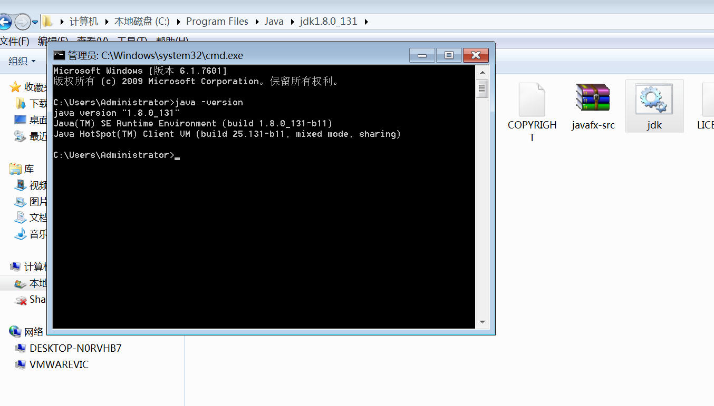

# 自动配置环境变量

## JDK环境变量自动配置

1.首先安装32位版本的jdk

2.安装完毕找到jdk安装目录，将jdk.bat放入jdk\bin的目录下

3.双击jdk.bat

4.输入java -version 检查是否配置成功，如下图显示说明配置成功

## TOMCAT 环境变量配置

1.新版本的tomcat免安装版本不能自动获取JDK的环境变量，所以需要在setclasspath.bat,手动添加JDK安装目录

2.双击tomcat.bat,如下图所示输入tomcat的bin目录C:\avatech\apache-tomcat-test\bin，点击Enter

3.如下图所示，安装成功

## TOMCAT 自动生产windows服务

1.找到service.bat 将下面路径改完你的tomcat\bin下的目录，修改服务名称，修改完毕保存，双击service.bat

2.打开cmd 输入services.msc,如下图所示服务安装成功

