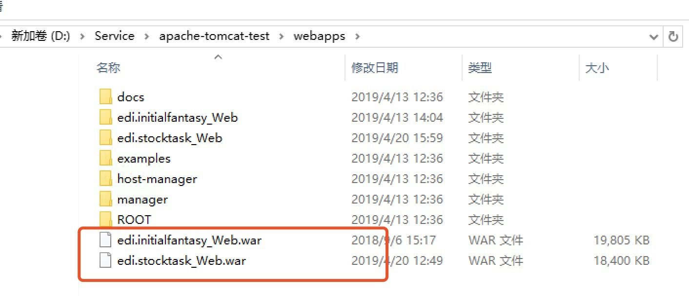

# 条码App后端服务部署说明

[TOC]

## 一、基础环境

### 1.1自定义字段

|模块|自定义字段|描述|类型|长度|备注|
|--|--|--|--|--|--|
|用户|IME|是否移动端用户|字符|1|有效值：Y：是；N：否|
|用户|Is_Supper|是否仓库管理员|字符|1||
|用户|MobileUserId|移动端用户名|字符|8|条码登录用户名|
|用户|MobilePassword|移动端用户密码|字符|8|条码登录用户密码|
|营销单据|Sanctified|单据状态|字符|1|有效值:P:计划;R:下达|
|营销单据|ReporterId|汇报人|字符|8|链接值为OUSR的userid|
|生产订单|Sanctified|单据状态|字符|1|有效值:P:计划;R:下达|
|生产订单|ReporterId|汇报人|字符|8|链接值为OUSR的userid|

### 1.2、数据脚本初始化

说明
1）sql脚本位于sqlscript文件夹中；
2）sql脚本需严格按照以下顺序执行；
3）sql脚本执行前先添加自定义字段。

|顺序|脚本名称|类别|说明|是否必须|
|-------|-------|---|----|--|
|1|AVA_IF_VIEW_USER|视图|用户登录信息|是|
|2|AVA_IF_USERAUTH|表|存储用户登录验证信息|是|
|3|AVA_IM_Company|表|存储公司信息，应初始化公司帐套信息|是|
|4|AVA_VM_OSRP|表|存储汇报主表信息|是|
|5|AVA_VM_SRP1|表|存储汇报明细信息|是|
|6|AVA_VM_SRP2|表|存储汇报序列号/批次号信息|是|
|      |                  |      |                                    |          |
|      |                  |      |                                    |          |
|      |                  |      |                                    |          |
|      |                  |      |                                    |          |
|      |                  |      |                                    |          |
|      |                  |      |                                    |          |
|      |                  |      |                                    |          |
|      |                  |      |                                    |          |
|      |                  |      |                                    |          |
|      |                  |      |                                    |          |
|      |                  |      |                                    |          |
|      |                  |      |                                    |          |
|      |                  |      |                                    |          |
|      |                  |      |                                    |          |
|      |                  |      |                                    |          |
|      |                  |      |                                    |          |

### 1.3、服务运行环境准备

​	后端服务采用Java开发，开发jdk采用1.8版本，发布包为war包。在部署服务之前，请先确认服务器安装的DI版本（32位还是64位），安装的jdk版本/tomcat版本必须与DI版本一致，而非计算机版本相同。

​	由于DI占用内存较多，且发布成windows service后，发生异常容易导致服务停止。因此同步B1服务需单独部署到tomcat下并发布成windows service。服务部署结构如下图：

## 二、服务部署

发布包简介：
|war包|说明|
|--|--|
|edi.initialfantasy_Web.war|服务入口，登录校验服务|
|edi.stocktask_Web.war|库存模块服务|
|edi.businessone_Web.war|库存同步B1服务|

### 2.1、app服务发布

1）上传war包

​	首先将edi.initialfantasy_Web.war包和edi.stocktask_Web.war包粘贴至tomcat的webapp目录下，并启动tomcat，待在浏览器输入http:localhost:8080后（或war包被成功解压后），停止运行tomcat服务。

2）增加hana的jdbc驱动

​	检查解压后的文件夹下web-info/lib 下是否存在ngdbc.jar包，若不存在，将ngdbc.jar包拷贝至此目录中。

3）更新数据库连接配置文件

​	在web-info/classes目录下，打开spring-mybatis.xml文件，更新数据库连接的驱动地址、数据连接地址、用户名和密码。

4）更新mapper文件

​	从mapper目录下拷贝对应服务的mapper文件拷贝到相应服务的web-info/classes/mappers目录下。

5）公司帐套信息维护

​	app的多帐套通过调用接口获取公司帐套配置文件的信息。路径为initialfantasy模块的web-info/classes

| 字段        | 描述         |
| ----------- | ------------ |
| shortName   | 公司代码     |
| companyName | 公司帐套名称 |
| servicePath | 接口服务地址 |

​	

​	App登录需调用登录接口，登录包含关联公司的查询，所以需在公司表AVA_IF_Company维护帐套信息

* 注意shortName要与配置文件中的shortName的值一致。

### 2.1.1 测试tomcat服务能否启动

1）打开服务文件夹下的bin目录，双击startup.bat

2）如若窗口一闪而过，根据下方的链接去查找失败原因，此次不再详细赘述

https://blog.csdn.net/qq904069486/article/details/80909780

3）如若启动窗口如下图所示说明启动成功，下一步可以发布成windows服务

###  2.2 库存同步B1服务发布

1）上传war包

拷贝edi.businessone_Web.jar包至对应tomcat等webapp目录下，确保jar包被成功解压后，停止运行服务。

2）更新DI连接配置文件

3）更换JCO jar包

### 2.3 注册windows 服务

​	由于需要部署多个tomcat服务，并将tomcat服务注册windows服务，需要修改tomcat默认的配置信息

1）配置环境变量

​	配置CATALINA_HOME和CATALINA_BASE环境变量，指向对应的tomcat目录；

2）修改service.xml端口配置

​	找到conf目录下的service.xml配置，修改server端口（此端口用与监听tomcat关闭的端口，因此三个tomcat的server端口必须不相同）和protocol="HTTP/1.1"的Connector端口（tomcat启动后监听此端口http请求）。

3）修改tomcat脚本

​	找到bin目录下的catalina.bat、start.bat和shutdown.bat，将三个脚本下所有的`%CATALINA_HOME%` 和`%CATALINA_BASE%` 都替换成 第一步配置的环境变量。（替换过程中注意对应关系）	

​	修改catalina.bat中的TITLE，将TiTLE的值修改为能区分开的服务名称。

4）安装windows服务

​	在tomcat的bin目录下，按住`Shilft` 键并鼠标右键，选择在此处打开命令窗口，输入`service.bat install <service name>` 安装服务，输入`service.bat remove <service name>` 卸载服务。

​	显示安装成功后，在服务中可查找到对应服务

关于多个tomcat服务注册windows服务可参考： https://blog.csdn.net/mo_feng_/article/details/78680239

## 三、服务测试连接

启动tomcat之后，在浏览器中输入服务发布的ip地址以及tomcat的端口号，如出现下方页面说明服务启动成功。

##  3.1获取公司地址测试

## 3.2登录接口测试

## 3.3 库存任务查询测试

